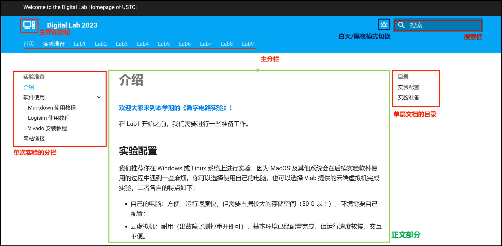

# <strong>计算机组成原理</strong>

<figure markdown>
{ width="480" }
</figure>

<!-- 标题的字体： https://www.fontspace.com/sporting-font-f102490-->
<!-- old https://www.fontspace.com/xeroda-font-f102367 -->

<!-- > 想要了解数电实验提高班？请点击这里！ -->

!!! Info "说明"

    本课程主页为 2024 春季学期卢建良老师班《计算机组成原理》课程主页，包含了理论课与实验课的相关信息。

## <strong>课程简介</strong>

中国科学技术大学《计算机组成原理》课程是面向计算机科学与技术学院本科生的一门专业核心基础课。
本课程介绍了运算器、控制器、存储器的结构、工作原理、设计方法及互连构成整机的有关技术，
有助于学生深刻理解现代数字计算机系统的工作原理及软硬件设计中的折中思想，
引导学生体验完整的设计过程，解决工程设计面临的实际问题。

<!-- { align=right width="240"} -->

!!! Example "系列课程"

    我校的计算机系统结构系列实验包括下面的几门课程：

    - <strong>数字电路实验</strong>：注重对数字部件的分析与设计；
    - <strong>计算机组成原理实验</strong>：注重微处理器原理与设计；
    - <strong>计算系统综合实验</strong>：注重片上系统设计与应用；
    - <strong>计算机体系结构实验</strong>：注重系统层面的优化加速。

    其中，我们的《计算机组成原理》在课程体系中起到承上启下的作用。

## <strong>课程信息</strong>

### <strong>上课时间与地点</strong>

<strong>理论课（卢老师班）</strong>

- 教学周：1~15 周
- 教室：3C102
- 节次：1(6,7)、3(6,7)

<strong>实验课</strong>

- 时间：2024-03-18 开始，每周一、周三晚上 18:30~21:30
- 教室：电三楼 406、408

### <strong>联系方式</strong>

<strong>教师</strong>

- 卢建良 lujl@ustc.edu.cn  
  电三楼 411 室

<strong>助教</strong>

- 吴骏东 wintermelon@mail.ustc.edu.cn
- 唐灏 TH20030818@mail.ustc.edu.cn 
- 刘睿博 liuruibo21@mail.ustc.edu.cn
- 常文正 amberzheng@mail.ustc.edu.cn
- 马子睿 madrid@mail.ustc.edu.cn        （线上）
- 沈周毅 squirrel@mail.ustc.edu.cn      （协助）
- 郑滕飞 richardzheng@mail.ustc.edu.cn  （协助）

<strong>QQ 群</strong>

详见课堂通知。

<!-- 为了便于大家的交流，我们额外设置了匿名反馈渠道[《组成原理反馈收集》](https://www.wenjuan.com/s/UZBZJvIgkl/#)。欢迎大家在这里提供对于实验的反馈，例如难以解决的 Bugs、对实验的疑问与吐槽等。我们也将选择有价值的反馈同步到对应的在线文档中。 -->

### <strong>课程日历</strong>

点击[这里](other/note.md)前往。

<!-- 

	
	

		

	

	

	    夜晚的电三楼
	

<strong>检查时间地点（二选一）</strong>：

- 周四下午 14:00 ~ 17:00、西区电三楼 406 实验室

- 周四晚上 18:30 ~ 21:30、西区电三楼 406 实验室

<figure markdown>
{ width="600" }
</figure>

<strong>自由上机时间地点（仅安排答疑，不检查实验）</strong>：

- 周三下午 14:00 ~ 17:00、西区电三楼 410 实验室

<figure markdown>
{ width="500" }
</figure> 

!!! Info "说明"

    实际的检查时间以自己所在组助教的安排为准。

-->

### <strong>课程评分</strong>

本课程的评分包含以下几部分：

- 理论课：60%
- 实验课：40%
- 考勤：10 分。<strong>通过课堂签到获取，仅当不及格时使用。</strong>

!!! Note "提醒"

    由于存在优秀率限制，我们最终会进行统一的保序调分，因此大家的总评成绩可能会与按照上述公式计算得到的总成绩存在一定差异。

## <strong>如何使用本文档？</strong>

### <strong>关于提示框</strong>

为了便于标识，我们在文档中提供了若干提示框。它们有着不同的形式与作用。例如：

!!! Note "一般的提示框长这样"

    里面是这样的文字。

??? Question "有的提示框默认是折叠的，需要点击才能展开"

    然后看到里面的内容。

???+ Success "有的提示框则是默认展开的"

    如果觉得碍事可以点击折叠。

!!! Example "大家可以在后续的文档中接触到它们。"

### <strong>关于界面</strong>

下图展示了一些常用的页面功能：

<figure markdown>
{ width="700" }
</figure>

### <strong>关于搜索</strong>

你可以在右上角搜索框中输入想要查询的关键词，文档会给出对应的查询结果与跳转链接。

???+ Note "Tips"

    如果在阅读文档时发现有自己不清楚的知识点，可以先用搜索框查询其是否在先前的文档中出现过。

!!! Example "加入我们"

    如果你对于硬件实验教学、实验平台维护、在线文档编写、硬件设计等领域感兴趣，或是想参与实际的项目开发，欢迎访问[这里](https://vlab.ustc.edu.cn/docs/recruit/)加入我们！

???+ Bug "评论系统"

    由于主页上的评论系统映射可能出现问题，以防万一，我们在这里进行一些补充。

    除了上面介绍的内容，本学期的实验文档我们还额外添加了评论系统。大家可以在各个界面下方找到类似的评论栏，登录自己的 GitHub 账号即可发表相应的评论。

    <strong>怎么使用？</strong>

    评论系统的输入采用 Markdown 格式。如果你之前没有用过 Markdown，可以简单地将其当做普通文本（txt）格式，直接输入文字并点击评论即可。如果你对 Markdown 语法有所了解，可以使用 **加粗**、 *斜体* 、句内的 `code block` 等特殊格式，以及相应的标题结构。

    除了留下自己的疑问，大家也可以解答其他同学的疑问。这是一个相互交流、相互合作的平台。我们鼓励合理范围内的讨论与思考~

    <strong>其他方式</strong>

    评论系统实际上是抓取了[这个仓库](https://github.com/wintermelon008/USTC-CODLab-Discussion)下讨论区的内容，所有的评论也会发布在这里。大家可以访问上面的仓库进行阅读。

    如果你没有或者无法登录 GitHub 账号也没关系。除了文档下方的评论系统，在实验 QQ 群、各小组 QQ 群中大家也可以提出自己的问题，我们将统一进行解答。

    欢迎大家在评论系统里畅所欲言！