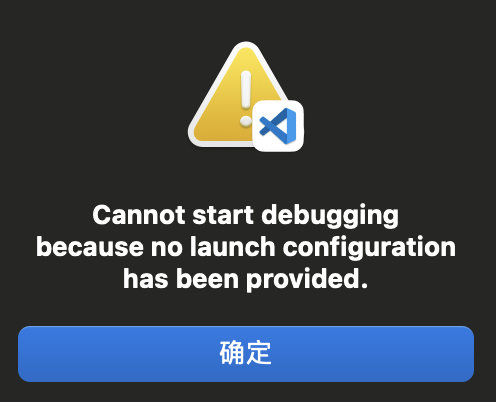
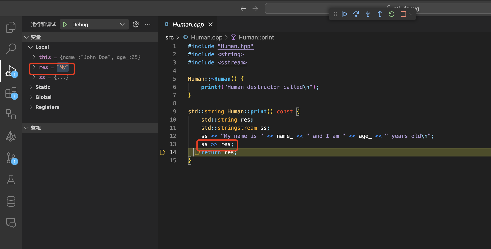

# 在CMake构建的大型项目中如何Debug

??? Info "CMake"

    CMake 是一个开源的跨平台构建系统工具，用于管理项目的构建过程。它使用简单的文本文件（CMakeLists.txt）来定义项目的构建配置，并生成标准的构建文件（如 Makefile 或 Visual Studio 工程文件）

对于一个大型工程而言，Debug 是相对困难的，我们为大家提供了两种可行的 Debug 方法，**<font color = red>这两种调试方法并不是互斥的，我们强烈建议组合使用</font>**

## Clangd语言服务器

大家在以往写 C/C++ 工程时，肯定都使用过 Microsoft C/C++ ，但该扩展在较大的的项目中表现并不优秀。我们强烈建议大家使用 Clangd 并在 VSCode 中安装 Clangd 扩展。

在终端输入以下命令安装 Clangd ：
```shell
sudo apt install clangd
```
安装完成后在VSCode中搜索 Clangd 并安装

    
由于 Clangd 和 Microsoft C/C++ 扩展冲突，我们建议大家在使用 Clangd 时禁用 Microsoft C/C++ 扩展。

如果正确安装了 Clangd，那么可以通过以下方式进行跳转：

- **跳转到定义**：在光标停留在某个函数或变量上时，按下`F12`键即可跳转到定义。
- **跳转到实现**：在光标停留在某个函数或变量上时，按下`Ctrl`+`F12`即可转到实现。
- **跳转到引用**：在光标停留在某个函数或变量上时，按下`Shift`+`F12`键即可转到引用。

同时，Clangd 还提供了强大的代码补全功能和错误提示功能，可以帮助同学们更好地编写代码。大家可以在之后的实验中一一体验。


## 如何在CMake构建的大型项目中定位 Segmentation Fault

??? Info "什么是 **ASAN** "

    ASAN（Address Sanitizer）是针对 C/C++ 的快速内存错误检测工具，在运行时检测 C/C++ 代码中的多种内存错误。

    ASAN 早先是 LLVM 中的特性，后被集成到 GCC 4.8 中，在 4.9 版本中加入了对 ARM 平台的支持。

??? Warning "请先拉取最新仓库"
    
    ```bash

    git pull

    ```

??? Info "ASAN 效果展示"

    w/o ASAN :

    ```shell

    jyjs@jyjs-virtual-machine:~/Documents/2024ustc-jianmu-compiler/build$ ./src/lab0_debug -t
    Hello, from stl_debug!
    MyMyI'mStudent object created
    Segmentation fault (core dumped)

    ```

    w/ ASAN :

    ```shell
    Hello, from stl_debug!
    MyMyI'mStudent object created
    =================================================================
    ==8882==ERROR: AddressSanitizer: heap-use-after-free on address 0x603000000040 at pc 0x59d0dfac18f8 bp 0x7fff6e82d060 sp 0x7fff6e82d050
    READ of size 8 at 0x603000000040 thread T0
        #0 0x59d0dfac18f7 in std::_List_iterator<int>::operator++() (/home/jyjs/Documents/2024ustc-jianmu-compiler/build/src/lab0_debug+0x188f7)
        #1 0x59d0dfabe9c4 in main /home/jyjs/Documents/2024ustc-jianmu-compiler/src/main.cpp:37
        #2 0x7ba1e7e29d8f in __libc_start_call_main ../sysdeps/nptl/libc_start_call_main.h:58
        #3 0x7ba1e7e29e3f in __libc_start_main_impl ../csu/libc-start.c:392
        #4 0x59d0dfabd9c4 in _start (/home/jyjs/Documents/2024ustc-jianmu-compiler/build/src/lab0_debug+0x149c4)

    0x603000000040 is located 0 bytes inside of 24-byte region [0x603000000040,0x603000000058)
    freed by thread T0 here:
        #0 0x7ba1e8eb724f in operator delete(void*, unsigned long) ../../../../src/libsanitizer/asan/asan_new_delete.cpp:172
        #1 0x59d0dfac69a4 in __gnu_cxx::new_allocator<std::_List_node<int> >::deallocate(std::_List_node<int>*, unsigned long) (/home/jyjs/Documents/2024ustc-jianmu-compiler/build/src/lab0_debug+0x1d9a4)
        #2 0x59d0dfac5a86 in std::allocator_traits<std::allocator<std::_List_node<int> > >::deallocate(std::allocator<std::_List_node<int> >&, std::_List_node<int>*, unsigned long) (/home/jyjs/Documents/2024ustc-jianmu-compiler/build/src/lab0_debug+0x1ca86)
        #3 0x59d0dfac4827 in std::__cxx11::_List_base<int, std::allocator<int> >::_M_put_node(std::_List_node<int>*) (/home/jyjs/Documents/2024ustc-jianmu-compiler/build/src/lab0_debug+0x1b827)
        #4 0x59d0dfac32a6 in std::__cxx11::_List_base<int, std::allocator<int> >::_M_clear() (/home/jyjs/Documents/2024ustc-jianmu-compiler/build/src/lab0_debug+0x1a2a6)
        #5 0x59d0dfac137c in std::__cxx11::_List_base<int, std::allocator<int> >::~_List_base() (/home/jyjs/Documents/2024ustc-jianmu-compiler/build/src/lab0_debug+0x1837c)
        #6 0x59d0dfabff19 in std::__cxx11::list<int, std::allocator<int> >::~list() (/home/jyjs/Documents/2024ustc-jianmu-compiler/build/src/lab0_debug+0x16f19)
        #7 0x59d0dfac2059 in std::__cxx11::list<int, std::allocator<int> >::remove(int const&) (/home/jyjs/Documents/2024ustc-jianmu-compiler/build/src/lab0_debug+0x19059)
        #8 0x59d0dfabe9b5 in main /home/jyjs/Documents/2024ustc-jianmu-compiler/src/main.cpp:38
        #9 0x7ba1e7e29d8f in __libc_start_call_main ../sysdeps/nptl/libc_start_call_main.h:58

    previously allocated by thread T0 here:
        #0 0x7ba1e8eb61e7 in operator new(unsigned long) ../../../../src/libsanitizer/asan/asan_new_delete.cpp:99
        #1 0x59d0dfac6fd3 in __gnu_cxx::new_allocator<std::_List_node<int> >::allocate(unsigned long, void const*) (/home/jyjs/Documents/2024ustc-jianmu-compiler/build/src/lab0_debug+0x1dfd3)
        #2 0x59d0dfac69ed in std::allocator_traits<std::allocator<std::_List_node<int> > >::allocate(std::allocator<std::_List_node<int> >&, unsigned long) (/home/jyjs/Documents/2024ustc-jianmu-compiler/build/src/lab0_debug+0x1d9ed)
        #3 0x59d0dfac5aec in std::__cxx11::_List_base<int, std::allocator<int> >::_M_get_node() (/home/jyjs/Documents/2024ustc-jianmu-compiler/build/src/lab0_debug+0x1caec)
        #4 0x59d0dfac4970 in std::_List_node<int>* std::__cxx11::list<int, std::allocator<int> >::_M_create_node<int>(int&&) (/home/jyjs/Documents/2024ustc-jianmu-compiler/build/src/lab0_debug+0x1b970)
        #5 0x59d0dfac3452 in void std::__cxx11::list<int, std::allocator<int> >::_M_insert<int>(std::_List_iterator<int>, int&&) (/home/jyjs/Documents/2024ustc-jianmu-compiler/build/src/lab0_debug+0x1a452)
        #6 0x59d0dfac14bf in std::__cxx11::list<int, std::allocator<int> >::push_back(int&&) (/home/jyjs/Documents/2024ustc-jianmu-compiler/build/src/lab0_debug+0x184bf)
        #7 0x59d0dfabe7d2 in main /home/jyjs/Documents/2024ustc-jianmu-compiler/src/main.cpp:36
        #8 0x7ba1e7e29d8f in __libc_start_call_main ../sysdeps/nptl/libc_start_call_main.h:58

    SUMMARY: AddressSanitizer: heap-use-after-free (/home/jyjs/Documents/2024ustc-jianmu-compiler/build/src/lab0_debug+0x188f7) in std::_List_iterator<int>::operator++()
    Shadow bytes around the buggy address:
    0x0c067fff7fb0: 00 00 00 00 00 00 00 00 00 00 00 00 00 00 00 00
    0x0c067fff7fc0: 00 00 00 00 00 00 00 00 00 00 00 00 00 00 00 00
    0x0c067fff7fd0: 00 00 00 00 00 00 00 00 00 00 00 00 00 00 00 00
    0x0c067fff7fe0: 00 00 00 00 00 00 00 00 00 00 00 00 00 00 00 00
    0x0c067fff7ff0: 00 00 00 00 00 00 00 00 00 00 00 00 00 00 00 00
    =>0x0c067fff8000: fa fa 00 00 00 fa fa fa[fd]fd fd fa fa fa fa fa
    0x0c067fff8010: fa fa fa fa fa fa fa fa fa fa fa fa fa fa fa fa
    0x0c067fff8020: fa fa fa fa fa fa fa fa fa fa fa fa fa fa fa fa
    0x0c067fff8030: fa fa fa fa fa fa fa fa fa fa fa fa fa fa fa fa
    0x0c067fff8040: fa fa fa fa fa fa fa fa fa fa fa fa fa fa fa fa
    0x0c067fff8050: fa fa fa fa fa fa fa fa fa fa fa fa fa fa fa fa
    Shadow byte legend (one shadow byte represents 8 application bytes):
    Addressable:           00
    Partially addressable: 01 02 03 04 05 06 07 
    Heap left redzone:       fa
    Freed heap region:       fd
    Stack left redzone:      f1
    Stack mid redzone:       f2
    Stack right redzone:     f3
    Stack after return:      f5
    Stack use after scope:   f8
    Global redzone:          f9
    Global init order:       f6
    Poisoned by user:        f7
    Container overflow:      fc
    Array cookie:            ac
    Intra object redzone:    bb
    ASan internal:           fe
    Left alloca redzone:     ca
    Right alloca redzone:    cb
    Shadow gap:              cc
    ==8882==ABORTING
    ```

构建 CMake 项目时，可以手动添加 ASAN 功能来定位 Segmentation Fault 问题，

即使用`cmake .. -DCMAKE_BUILD_TYPE=ASAN`替换`cmake ..`

需要注意的是，当你想关闭这个功能时需要清空 build 文件夹重新构建项目。

## 图形化的LLDB调试工具

???+ Info "依赖"

    这种调试方法实际上是使用了lldb调试工具以及VSCode `CodeLLDB`扩展。

    使用以下命令安装lldb:

    (apt)

    ```shell
        sudo apt install lldb
    ```

    (brew)

    ```shell
        brew install lldb
    ```

    在VSCode安装扩展：
    - CodeLLDB
        
    - CMake & CMake Tools
        

    **安装CMake扩展后会弹出窗口提示选择工具包(ToolKit)，请选择最高版本的clang**。

LLDB是LLVM项目开发的调试器，通过设置VSCode扩展可以方便地调试大型项目。下面将以一个小型工程为例：

### 克隆需要的测试工程并构建项目

```shell
git clone https://cscourse.ustc.edu.cn/vdir/Gitlab/compiler_staff/2024ustc-jianmu-compiler.git
cd 2024ustc-jianmu-compiler
git checkout lab0
mkdir build
cd build
cmake ..
make
```

或者你可以直接点击下边栏的生成：


经过这一步后，在`${workspaceFolder}/build/src/`下可以找到生成的可执行文件`lab0_debug`

运行lab0_debug，你会得到类似下面的输出：

```shell

jyjs@JHost stl_debug % ./build/src/lab0_debug -t
Hello, from stl_debug!
MyMyI'mStudent object created
Student destructor called
Human destructor called
Human destructor called
```

而阅读这个项目的源码我们可以得知，期望的输出是：

```shell

jyjs@JHost stl_debug % ./build/src/lab0_debug -t
Hello, from stl_debug!
My name is John Doe and I am 25 years old
My name is Jane Doe and I am 20 years old
I'm from MIT
Student object created
Student destructor called
Human destructor called
Human destructor called
```

我们将在下面一小节来带大家de出这个bug！

### json 文件设置及 debug 示例

`.vscode/launch.json`文件记录了调试器需要的基本信息，它是由vscode自动生成的。

??? Info "如何自动生成一个.json文件"

    点击`运行/启动调试(F5)`：

    
    
    上方提示栏弹出，选择LLDB：

    

    这时由于vscode的CODELLDB扩展不知道如何调试，会报错并为我们创建`.vscode/launch.json`文件。

    

    ```json
    {
        // 使用 IntelliSense 了解相关属性。 
        // 悬停以查看现有属性的描述。
        // 欲了解更多信息，请访问: https://go.microsoft.com/fwlink/?linkid=830387
        "version": "0.2.0",
        "configurations": [
            {
                "type": "lldb",
                "request": "launch",
                "name": "Debug",
                "program": "${workspaceFolder}/<executable file>",
                "args": [],
                "cwd": "${workspaceFolder}"
            }
        ]
    }
    ```
    下文的json文件就是这么得到的，只不过助教做了一些注释。

```json
{
    // 使用 IntelliSense 了解相关属性。 
    // 悬停以查看现有属性的描述。
    // 欲了解更多信息，请访问: https://go.microsoft.com/fwlink/?linkid=830387
    "version": "0.2.0",
    "configurations": [
        {
            "type": "lldb",
            "request": "launch",
            "name": "Debug",
            "program": "${workspaceFolder}/<executable file>",  //TODO: Add executable file here
            "args": [
                "<arguments>" // TODO: Add arguments here
            ],
            "cwd": "${workspaceFolder}"
        }
    ]
}
```

- version 域指定了调试器的版本信息
- configurations 域指定了配置信息，其中包括：
    -  type：任务类型 这是一个lldb任务
    -  request：需要执行的任务 launch即只有它本身
    -  name：将这个任务命名为Debug
    -  program：被调试的程序 注： *<font color=grey>${workspaceFolder} 是一个环境变量，即工程文件所在文件夹</font>*
    -  args：设置需要的参数
    -  cwd：指令执行的目录

主要修改 program & args 域即可。

---

读工程中的CMakeLists.txt文件即可得知，生成的可执行文件目录为`${workspaceFolder}/build/src/`，可执行文件名为`lab0_debug`

而main.cpp:17-20L 要求输入-t参数，因此可以做如下修改：

```json

...
    "program": "${workspaceFolder}/build/src/lab0_debug",
    "args": [
        "-t",
    ],
...

```

之后在main入口处打断点再执行即可开始调试了。


在`h->print()`处 step in 之后，不难发现是print方法的返回值逻辑处理有误。



将Student.cpp:16L & Human.cpp:13L 用`res = ss.str();`代替后，重新make(构建)项目并运行。

```shell
cd build; make; cd ..
./build/src/lab0_debug -t
```

输出如下：

```shell
jyjs@JHost stl_debug % cd build; make; cd ..
[ 20%] Building CXX object src/CMakeFiles/lab0_debug.dir/main.cpp.o
[ 40%] Building CXX object src/CMakeFiles/lab0_debug.dir/Human.cpp.o
[ 60%] Building CXX object src/CMakeFiles/lab0_debug.dir/Student.cpp.o
[ 80%] Building CXX object src/CMakeFiles/lab0_debug.dir/logging.cpp.o
[100%] Linking CXX executable lab0_debug
[100%] Built target lab0_debug
jyjs@JHost stl_debug % ./build/src/lab0_debug -t
Hello, from stl_debug!
My name is John Doe and I am 25 years old
My name is Jane Doe and I am 20 years old
I'm from MIT
Student object created
Student destructor called
Human destructor called
Human destructor called
```

## logging 工具使用

### 介绍

为了方便同学们在之后的实验中 debug，为大家设计了一个 C++ 简单实用的分级日志工具。该工具将日志输出信息从低到高分成四种等级：`DEBUG`，`INFO`，`WARNING`，`ERROR`。通过设定环境变量 `LOGV` 的值，来选择输出哪些等级的日志。`LOGV` 的取值是 **0 到 3**，分别对应到上述的 4 种级别 (`0:DEBUG`,`1:INFO`,`2:WARNING`,`3:ERROR`)。此外输出中还会包含打印该日志的代码所在位置。

### 使用

项目编译好之后，可以在 `build/src` 目录下运行 test_logging 可执行文件，该文件的源代码在 `src/test_logging.cpp`，用法如下：

```cpp
#include "logging.hpp"
// 引入头文件
int main(){
    LOG(DEBUG) << "This is DEBUG log item.";
    // 使用关键字 LOG，括号中填入要输出的日志等级
    // 紧接着就是<<以及日志的具体信息，就跟使用 std::cout 一样
    LOG(INFO) << "This is INFO log item";
    LOG(WARNING) << "This is WARNING log item";
    LOG(ERROR) << "This is ERROR log item";
    return 0;
}
```

接着在运行该程序的时候，设定环境变量 `LOGV=0`，那么程序就会输出级别 **大于等于 0** 日志信息：

```bash
user@user:${ProjectDir}/build/src$ LOGV=0 ./test_logging
[DEBUG] (test_logging.cpp:5L  main)This is DEBUG log item.
[INFO] (test_logging.cpp:6L  main)This is INFO log item
[WARNING] (test_logging.cpp:7L  main)This is WARNING log item
[ERROR] (test_logging.cpp:8L  main)This is ERROR log item
```

输出中除了包含日志级别和用户想打印的信息，在圆括号中还包含了打印该信息代码的具体位置（包括文件名称、所在行、所在函数名称），可以很方便地定位到出问题的地方。

假如我们觉得程序已经没有问题了，不想看那么多的 DEBUG 信息，那么我们就可以设定环境变量 `LOGV=1`，选择只看 **级别大于等于 1** 的日志信息：

```bash
user@user:${ProjectDir}/build/src$ LOGV=0 ./test_logging
[INFO] (test_logging.cpp:6L  main)This is INFO log item
[WARNING] (test_logging.cpp:7L  main)This is WARNING log item
[ERROR] (test_logging.cpp:8L  main)This is ERROR log item
```

当然 `LOGV` 值越大，日志的信息将更加简略。如果没有设定 `LOGV` 的环境变量，将默认不输出任何信息。

这里再附带一个小技巧，如果日志内容多，在终端观看体验较差，可以输入以下命令将日志输出到文件中：

```
user@user:${ProjectDir}/build/src$ LOGV=0 ./test_logging > log
```

然后就可以输出到文件名为 log 的文件中啦～


## 实验任务
通过调试这个工程文件，回答下面三个问题：

1. 为什么用 main.cpp:31L 替换 main.cpp:32L 会出现报错？
2. 为什么用 main.cpp:33L 替换 main.cpp:34L 会出现报错？
3. 为什么取消注释 main.cpp:38-42L 不会报错，但运行会出现段错误？


