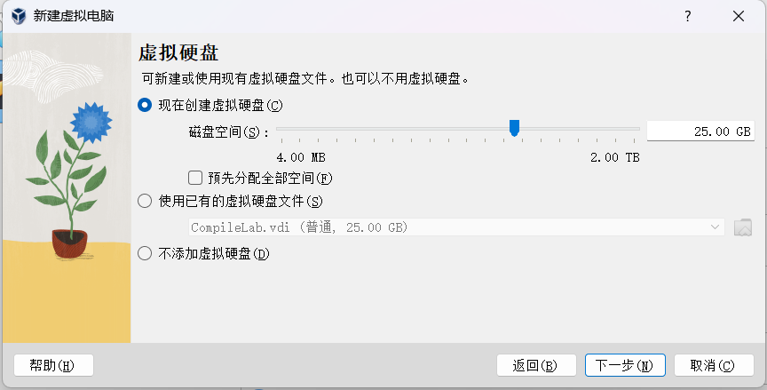
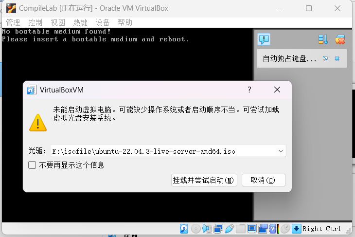
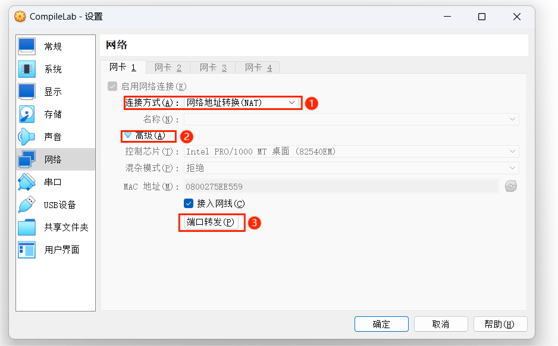
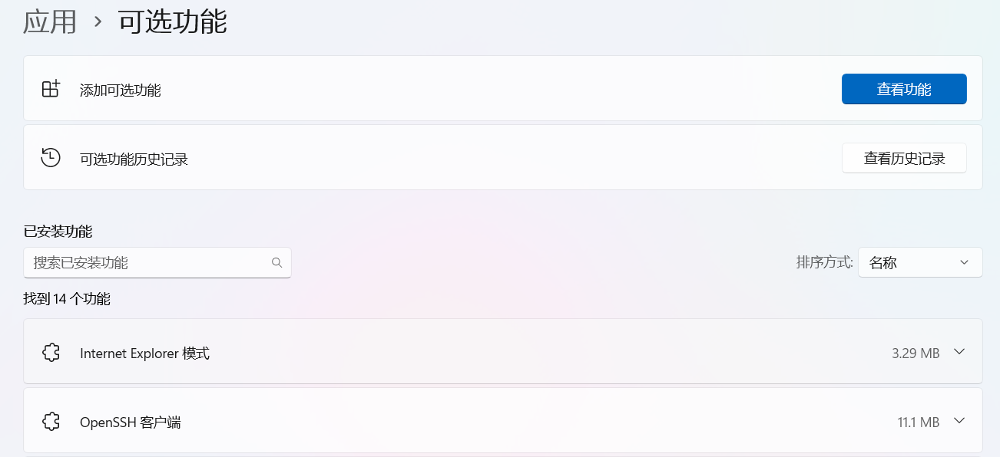
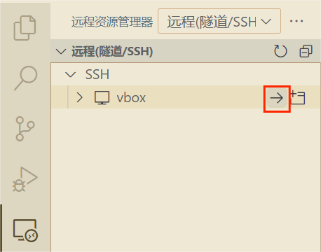
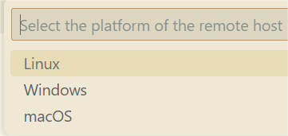

# Linux 环境配置

本页文档用于对本学期实验所使用的实验环境进行说明并提供相应的搭建建议。

本学期实验使用的 **核心软件** 版本为：

- Ubuntu 22.04
- LLVM 14.0.0
- Git 2.34.1
- CMake 3.22.1
- Flex 2.6.4
- Bison 3.8.2

!!! info "说明"

     文档主要针对非 Linux 系统用户，已搭建好 Linux 环境并且 **符合版本要求** 的同学可选择性跳过。

     如果在配置环境的时候出现问题，请联系助教。

     下面将介绍两款常见的虚拟机管理软件：**VirtualBox**、**VMWare**，任选其一即可！

## 1 Virtual Box

下面以虚拟机软件 VirtualBox 为例介绍搭建环境的方法。

### 1.1 下载

下载虚拟机软件：

- VirtualBox：[Downloads – Oracle VM VirtualBox](https://www.virtualbox.org/wiki/Downloads)

虚拟机软件的版本没有规定的要求，但必须满足基本需求。

下载 Ubuntu：

- 官网链接：[Ubuntu Releases](https://releases.ubuntu.com/)
- 科大镜像：[USTC Open Source Mirror](https://mirrors.ustc.edu.cn/ubuntu-releases/)
- 清华镜像：[Tsinghua Open Source Mirror](https://mirrors.tuna.tsinghua.edu.cn/ubuntu-releases/)

!!! warning "重要"

     本学期实验规定了相应的 Ubuntu 版本以方便后续软件的下载与使用，请各位同学 **务必** 下载使用推荐版本 **22.04**。

镜像文件请下载 **server** 版本，后续指导基于 server 版本展开。请下载命名为 ubuntu-22.04.4-live-server-amd64 的镜像文件。

下载完成之后无需打开镜像文件，只需在后续导入虚拟机软件即可。

### 1.2 创建、安装虚拟机（VirtualBox）

下面介绍 VirtualBox 创建、安装虚拟机的过程。

1. 点击“新建”创建虚拟机。设置虚拟机的名称，指定文件夹，设置类型与版本，虚拟光盘可以先不用指定：
    
2. 下一步后给虚拟机分配内存，请至少分配 2GB 以上的内存给虚拟机。对于处理器的分配可结合个人情况进行分配：
    
3. 下一步后给硬盘分配空间：
    
    如果各位同学只将该虚拟机用于本学期的实验那么设置最大磁盘大小为 25~40GB 即可，本学期的实验不会占用过多磁盘空间。但**不建议将磁盘大小设置过小**，因为磁盘空间不够引发的相关问题将会非常棘手。
4. 下一步后点击完成，虚拟机已经创建完毕，点击启动进入虚拟机：
    
5. 启动虚拟机后其会提示加载虚拟光盘，在这里选择我们先前已经按照的 Ubuntu 镜像文件：
    
6. 选择完毕后点击挂载并尝试启动，等待其出现如下的界面：
    
    按图示选择第一项后点击回车即可，以下 **选择确认时均需回车**。
7. 以后出现的界面选择较简单，选择默认选择即可；
8. 选择至出现下述界面，按自己喜好进行填写即可：
    
    > 务必记住 username 以及 password
9. 填写完后一路按照默认选择至如下界面并且下方出现 Reboot 时选择 Reboot 即可；注意当出现下述界面时需要 **保持等待**直到其出现 Reboot 按键：
    
10. 等待重启过程中如果界面卡住不发生变化时可以尝试按回车，例如出现如下界面时可按回车尝试解决：
     
11. 等到出现如下界面时输入你的用户名以及密码即可成功登录：
     
12. 出现此界面后即表示配置成功：
     

### 1.3 使用 VSCode

???+ info "VSCode"

     VSCode 由微软开发，是一款强大的跨平台代码编辑器。它提供美观的界面和可定制的主题，同时支持众多插件，如代码高亮、智能代码补全、括号匹配和代码比较，显著提升工作效率。此外，VSCode 还支持便捷的远程服务器连接，例如虚拟机，让你享受代码编写环境和预配置的 Linux 环境，大幅提高实验效率。熟练使用 VSCode 将为你后续的工作带来极大便利。

#### 1.3.1 下载 VSCode

前往[官网](https://code.visualstudio.com/download)进行下载即可。

#### 1.3.2 配置 VSCode［可选］

对 VSCode 进行基础配置可以参考[链接](https://zhuanlan.zhihu.com/p/87864677)。

对 VSCode 进行插件安装可以参考[链接](https://zhuanlan.zhihu.com/p/487406915)。

### 1.4 通过 VSCode 连接虚拟机

在开始指导连接虚拟机之前，我们需要明确一个重要事实：VSCode 并非用于直接连接虚拟机的工具，而是一款专注于代码（文本）编辑的应用程序。我们实际上是通过一种特殊的方式来实现虚拟机连接，而这种方式允许我们在 VSCode 中享受代码编写的环境。这个特殊的方式就是 SSH。

#### 1.4.1 SSH

SSH（Secure Shell）是一种网络协议，用于在计算机之间建立安全的远程连接和数据传输。它提供了一种加密的通信方式，可用于远程管理和安全数据传输。SSH 协议通常涉及两个主要组件：SSH 服务器（server）和 SSH 客户端（client）。

SSH 服务器（SSH Server）：

- SSH 服务器是运行在远程计算机上的软件或服务，它监听着 SSH 协议的连接请求，并允许远程用户通过 SSH 协议进行安全访问。
- 主要任务包括验证用户身份、管理连接请求、启动远程会话、执行命令和文件传输。

SSH 客户端（SSH Client）：

- SSH 客户端是运行在本地计算机上的软件或工具，用于连接到远程 SSH 服务器并与之通信。
- 客户端用于提供连接参数、身份验证凭据（通常是用户名和密码或 SSH 密钥）以及执行远程操作，例如运行远程命令、传输文件等。

##### 1.4.1.1 在 Linux 系统上安装 ssh server

在虚拟机中执行以下命令：

```shell
# 安装 ssh server
sudo apt install openssh-server
# 启动 ssh server
sudo systemctl start ssh
# 设置系统开机自启动
sudo systemctl enable ssh
```

检验是否启动成功，输入下述命令：

```shell
# 出现 /usr/sbin/sshd 类似信息则已启动成功
$ ps aux | grep sshd
root         765  0.0  0.0  15420  8784 ?        Ss   03:50   0:00 sshd: /usr/sbin/sshd -D [listener] 0 of 10-100 startups
```

##### 1.4.1.2 虚拟机网络设置

接下来，我们需要配置虚拟机的网络设置，以确保我们可以从主机访问虚拟机。

1. 打开虚拟机启动界面，在设置中选择网络：

    

2. 这里连接方式选择 <u>**NAT**</u>，在高级中选择端口转发：

    

3. 在出现的界面中添加一个转发规则：

    

    规则的名称可以自行命名，主机 IP 与子系统 IP 可以不填，子系统端口 **必须是 22**（为什么？）；主机端口可以随意，不产生端口冲突即可

4. 添加完后点击确认即可。

##### 1.4.1.3 在 Windows 系统上使用 ssh client

在 Windows 系统上，我们使用 OpenSSH client 来进行 SSH 连接。OpenSSH 是目前最流行的 SSH 协议实现，而且是一个开源项目，微软已经提供了对在 Windows 上使用 OpenSSH 的支持。

从 Windows10 开始系统自带 OpenSSH client，在 "设置"->"应用"->"可选功能"可以检查是否已经安装 OpenSSH client：



若没有安装，请参考[这里](https://blog.csdn.net/fjw044586/article/details/110940729#前言)。

##### 1.4.1.4 使用 ssh 连接虚拟机

打开 Windows PowerShell，在命令行输入以下内容进行 ssh 连接：

```shell
# -p 表示端口 后面数字为端口号
ssh -p 1145 虚拟机用户名@127.0.0.1
```


输入虚拟机用户对应的密码即可连接到虚拟机当中。

#### 1.4.2 使用 VSCode 连接虚拟机

由于在 VirtualBox 上配置的 Ubuntu server 没有图形化界面，不够美观的同时也无法可视化操作。这里我们推荐使用 VSCode 连接我们刚刚配置好的虚拟机，使用 VSCode 进行开发可以大大提高我们的开发效率。

在验证 ssh 连接虚拟机成功后，我们即可以通过 VSCode 来连接虚拟机。

##### 1.4.2.1 VSCode 设置

打开 VSCode 执行以下操作：

1. 下载并安装 Remote-SSH 插件：

    

    > remote-ssh 是一个专门用于通过 SSH 来远程连接服务器的辅助工具。

2. 下载完毕后在 VSCode 的左边栏找到远程资源管理器，在上方选择栏中选择 **远程（隧道/SSH）**：

    

3. 在 SSH 中点击设置，后选择 SSH 配置文件：

    

4. 在配置文件中加入如下代码段，保存：

    ```sshconfig
    # Host 名字可以随意
    Host vbox
      HostName 127.0.0.1
      # User 填入你自己的虚拟机 username
      User test
      # Port 填入在设置虚拟机网络时你填入的主机端口
      Port 4514
    ```

    随后刷新左侧列表可以在 SSH 下看到如下项：

    

5. 在自己设置的项（助教这里是 vbox）右侧点击右箭头开始连接：

    

6. 这里出现的 platform 选择 Linux：

    

7. 随后点击 Continue；

8. 输入你的虚拟机的密码；

9. 耐心等待连接，等到界面左下方出现如下情况即表示连接成功：

    

10. 随后即可在 VSCode 上愉快地使用虚拟机。VSCode 拥有一系列针对各种语言的插件，同学们按需安装，这里不再做过多展开。

##### 1.4.2.2 VSCode 连接虚拟机使用示例

我们已经成功通过 VSCode 连接了虚拟机，下面是一些简单的使用指导。

首先在 VSCode 中，我们可以使用快捷键 ``CTRL + ` `` 打开终端：


注意这个终端里的所有指令都是运行在你配置的虚拟机/服务器上，尝试如下指令：

```shell
# 查看虚拟机的相关信息
$ uname -a
Linux gpu12 5.4.0-156-generic #173-Ubuntu SMP Tue Jul 11 07:25:22 UTC 2023 x86_64 x86_64 x86_64 GNU/Linux

# mkdir 创建文件夹
# code 指令使用 VSCode 打开一个特定的工作区
$ mkdir Test
$ code Test
```

此时，会弹出一个新的 VSCode 窗口，该新窗口以 Test 文件夹作为 workspace。

下面，我们进行简单的文件创建和添加。选择 VSCode 的 explorer，并点击新建文件操作，新建文件 `testfile.txt`。


随后打开该文件，并输入相关信息。此时，我们已经通过 VSCode 在虚拟机上创建一个 `testfile.txt` 文件，且该文件位于 `Test` 文件夹下。


完成上述操作后，你可以在 VSCode 终端中或 virtualbox 的界面，在虚拟机中查看相关文件内容。

```shell
$ cd Test
$ cat testfile.txt
Hello VirtualBox!
```

通过这个例子，你应该已经掌握了使用 VSCode 连接远程服务器和修改相关文件等操作。

???+ tip "VSCode 远程服务器文件上传和下载"

     文件上传：直接拖拽桌面文件进入 VSCode 的 explorer

     文件下载：在 VSCode 的 explorer 中对相关文件进行右键并选择下载。

更多关于 VSCode 的操作，欢迎同学自行探索。

## 2 VMWare Workstation

### 2.1 下载

下载虚拟机软件：

- VMWare：[Downloads – VMWare](https://www.vmware.com/products/desktop-hypervisor/workstation-and-fusion)

虚拟机软件的版本没有规定的要求，但必须满足基本需求。

下载 Ubuntu：

(x86)

请下载命名为 ubuntu-22.04.4-live-server-amd64 的镜像文件

- 官网链接：[Ubuntu Releases](https://releases.ubuntu.com/)
- 科大镜像：[Index of /ubuntu-releases/ (ustc.edu.cn)](https://mirrors.ustc.edu.cn/ubuntu-releases/)
- 清华镜像：[Index of /ubuntu-releases/ | 清华大学开源软件镜像站 | Tsinghua Open Source Mirror](https://mirrors.tuna.tsinghua.edu.cn/ubuntu-releases/)

---

(arm)

请下载命名为 ubuntu-22.04.4-live-server-arm64 的镜像文件

- 科大镜像：[Index of /ubuntu-releases/ (ustc.edu.cn)](https://mirrors.ustc.edu.cn/ubuntu-cdimage/releases/22.04.4/release/)
- 清华镜像：[Index of /ubuntu-releases/ | 清华大学开源软件镜像站 | Tsinghua Open Source Mirror](https://mirrors.tuna.tsinghua.edu.cn/ubuntu-cdimage/releases/22.04.4/release/)

!!! warning "重要"

     本学期实验规定了相应的 Ubuntu 版本以方便后续软件的下载与使用，请各位同学 **务必** 下载使用推荐版本 **22.04**。

下载完成之后无需打开镜像文件，只需在后续导入虚拟机软件即可。

### 2.2 创建、安装虚拟机

点击`创建新的虚拟机`，之后跟随向导选择即可，下面是一些关键配置数据：

- 安装客户机系统时，选择安装程序映像文件，选择你刚刚下载的镜像文件
- 请记住你设置的密码
- 磁盘空间请设置25GB～40GB(推荐)
- 安装时语言尽量选择英文，否则你的home目录下可能会出现中文路径(可以进系统后换成中文)
- Installation Type 请选择Eraze disk and install Ubuntu

### 2.3 VS Code

请参照 [VS Code](#13-使用-vscode) 节，安装VS Code

### 2.4 通过 VSCode 连接虚拟机

打开虚拟机后，请点击 右键-在终端中打开 

```shell
sudo apt install net-tools openssh-server
sudo systemctl start ssh
sudo systemctl enable ssh
sudo systemctl restart ssh
ifconfig
```

ifconfig会输出你的所有网络接口(如果是新建的虚拟机，应该仅有两个接口)，请忽略`lo:`一组，它代表着本地环回。请记下另一组中的inet字段，例：`192.168.32.169`

打开 VSCode 执行以下操作：

1. 下载并安装 Remote-SSH 插件：

    

    > remote-ssh 是一个专门用于通过 SSH 来远程连接服务器的辅助工具。

2. 下载完毕后在 VSCode 的左边栏找到远程资源管理器，在上方选择栏中选择 **远程（隧道/SSH）**：

    

3. 在 SSH 中点击设置，后选择 SSH 配置文件：

    

4. 在配置文件中加入如下代码段，保存：

    ```sshconfig
    # Host 名字可以随意
    Host vbox
      # HostName 填入刚刚的inet字段
      HostName 192.168.32.169 # 请改掉
      # User 填入你自己的虚拟机 username
      User test
    ```

    随后刷新左侧列表可以在 SSH 下看到如下项：

    

之后的步骤和[上方](#1421-vscode-设置) 相同